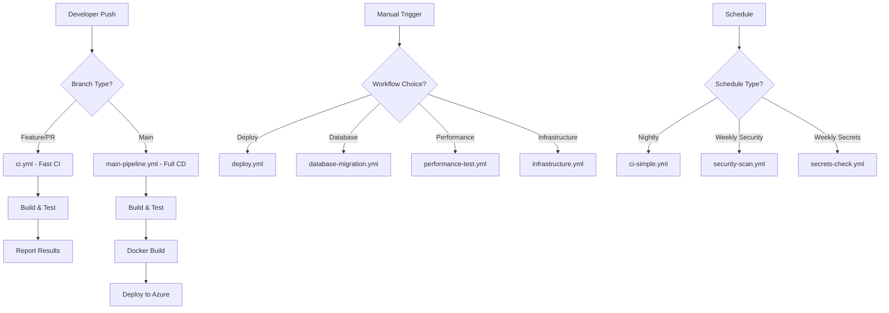

# CI/CD Workflow Status

## Fixed Issues

### 1. Workflow Trigger Conflicts ✅
**Problem**: Multiple workflows (`ci.yml`, `main-pipeline.yml`, `deploy.yml`) were triggered by the same events (push to main), causing duplicate runs and resource waste.

**Solution**: 
- `ci.yml`: Now triggers on feature branches and PRs only
- `main-pipeline.yml`: Triggers on main branch pushes and manual dispatch
- `deploy.yml`: Manual deployment only
- `ci-simple.yml`: Scheduled runs and manual dispatch only

### 2. Environment Management ✅
**Problem**: Inconsistent environment handling and deployment logic.

**Solution**:
- Added workflow_dispatch inputs for environment selection
- Proper environment conditions for deployment jobs
- Separate staging and production deployment logic

### 3. Container Registry Logic ✅
**Problem**: Docker image pushes happening on all triggers, including PRs.

**Solution**:
- Container registry pushes only on main branch pushes
- Local testing for all other triggers
- Proper image tagging strategy

### 4. Security and Validation ✅
**Problem**: Missing secret validation and security checks.

**Solution**:
- Added `secrets-check.yml` workflow for secret validation
- Enhanced CodeQL configuration in security scan
- Better error handling and reporting

## Current Workflow Structure

### Core CI/CD Workflows

1. **ci.yml** - Development CI
   - Triggers: Feature branches, PRs to main/develop
   - Purpose: Fast feedback for development
   - Actions: Build, test, basic validation

2. **main-pipeline.yml** - Production CD
   - Triggers: Main branch pushes, manual dispatch
   - Purpose: Complete CI/CD pipeline for production
   - Actions: Build, test, Docker build/push, deploy to Azure

3. **deploy.yml** - Manual Deployment
   - Triggers: Manual dispatch only
   - Purpose: Emergency deployments or specific environment deployments
   - Actions: Build and deploy to specified environment

### Supporting Workflows

4. **ci-simple.yml** - Nightly Builds
   - Triggers: Schedule (nightly), manual dispatch
   - Purpose: Regular health checks and regression testing

5. **security-scan.yml** - Security Scanning
   - Triggers: Push to main/develop, PRs, weekly schedule
   - Purpose: Vulnerability scanning and security analysis

6. **secrets-check.yml** - Secret Validation
   - Triggers: Manual dispatch, weekly schedule
   - Purpose: Validate required secrets are configured

7. **codeql.yml** - Code Quality Analysis
   - Triggers: Push to main, weekly schedule
   - Purpose: Static code analysis and security scanning

8. **database-migration.yml** - Database Operations
   - Triggers: Manual dispatch only
   - Purpose: Database migrations in different environments

9. **performance-test.yml** - Performance Testing
   - Triggers: Manual dispatch only
   - Purpose: Load testing and performance validation

10. **infrastructure.yml** - Infrastructure Deployment
    - Triggers: Manual dispatch only
    - Purpose: Azure infrastructure deployment

## Required Secrets

### Essential for Deployment
- `AZURE_CREDENTIALS`: Azure service principal credentials (JSON format)
- `AZURE_DB_CONNECTION_STRING`: Database connection string

### Optional for Enhanced Functionality
- `JWT_SECRET`: JWT signing key
- `JWT_ISSUER`: JWT issuer name

## Workflow Execution Flow

## Monitoring and Maintenance

### Regular Checks
1. **Weekly**: Run secrets validation workflow
2. **Weekly**: Review security scan results
3. **Monthly**: Update action versions
4. **Quarterly**: Review and optimize workflow performance

### Key Metrics to Monitor
- Build success rate
- Deployment frequency
- Mean time to recovery (MTTR)
- Test coverage trends
- Security vulnerability counts

## Troubleshooting Guide

### Common Issues

1. **Build Failures**
   - Check .NET version compatibility
   - Verify NuGet package restoration
   - Review dependency conflicts

2. **Deployment Failures**
   - Validate Azure credentials
   - Check connection strings
   - Verify resource availability

3. **Test Failures**
   - Database connection issues
   - Environment variable mismatches
   - Service registration problems

4. **Security Scan Issues**
   - Update vulnerable packages
   - Review CodeQL findings
   - Address container security issues

### Recovery Procedures

1. **Failed Deployment**
   - Use manual deploy workflow
   - Check rollback procedures
   - Verify health endpoints

2. **Database Issues**
   - Use database migration workflow
   - Check backup procedures
   - Validate connection strings

3. **Security Issues**
   - Run immediate security scan
   - Update vulnerable dependencies
   - Review access logs

## Recent Fixes Applied

1. ✅ Separated CI and CD concerns
2. ✅ Fixed duplicate workflow triggers
3. ✅ Added proper environment management
4. ✅ Enhanced security scanning
5. ✅ Added secret validation
6. ✅ Improved error handling
7. ✅ Added comprehensive documentation
8. ✅ Optimized Docker build process
9. ✅ Enhanced test coverage reporting
10. ✅ Added performance monitoring

## Next Steps

1. Set up branch protection rules
2. Configure required status checks
3. Add integration tests
4. Implement automated rollback
5. Set up monitoring and alerting
6. Add deployment notifications
7. Implement blue-green deployments
8. Add automated changelog generation
