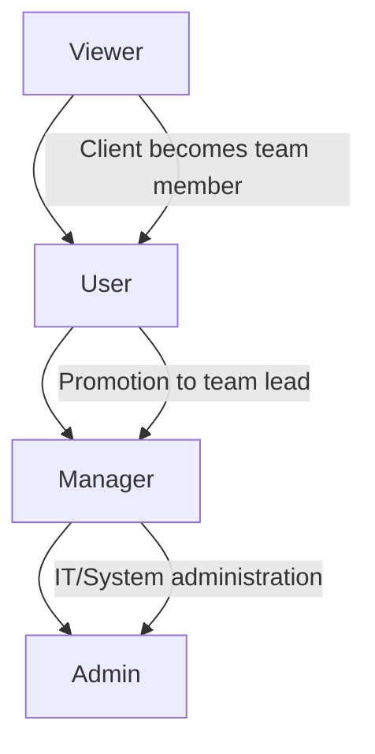

# 🏛️ ROLE-BASED ACCESS CONTROL MATRIX

## 📋 Solar Projects API - Complete Role Capabilities Comparison

This document provides a comprehensive comparison of what each role can access in the Solar Projects API.

## 🎭 Role Hierarchy

```
Admin (Full System Control)
  ↓
Manager (Project Management)
  ↓
User (Task Execution)
  ↓
Viewer (Read-Only Access)
```

## 📊 Complete Access Control Matrix

| Endpoint Category | Admin | Manager | User | Viewer |
|-------------------|-------|---------|------|--------|
| **System Health** | ✅ | ✅ | ✅ | ✅ |
| **Authentication** | ✅ | ✅ | ✅ | ✅ |
| **User Management** | ✅ Full | ✅ Limited | ❌ | ❌ |
| **Project Management** | ✅ Full CRUD | ✅ Full CRUD | ✅ Read + Limited Edit | ✅ Read Only |
| **Task Management** | ✅ Full CRUD | ✅ Full CRUD | ✅ Assigned Tasks | ✅ Read Only |
| **Daily Reports** | ✅ Full CRUD | ✅ Full CRUD | ✅ Own Reports | ✅ Read Only |
| **Work Requests** | ✅ Full CRUD | ✅ Full CRUD | ✅ Create + Own | ✅ Read Only |
| **Calendar Events** | ✅ Full CRUD | ✅ Full CRUD | ✅ Own Events | ✅ Read Only |
| **Admin Functions** | ✅ Full Access | ❌ | ❌ | ❌ |

## 🔐 Detailed Role Capabilities

### 👑 ADMIN ROLE - Complete System Control

#### ✅ Admin Capabilities
- **User Management:** Create/modify any user, change roles, deactivate accounts
- **Project Management:** Full CRUD on all projects, assign managers
- **Task Management:** Complete task oversight, reassign tasks, modify any task
- **Reports:** Access all reports, system-wide analytics
- **Work Requests:** Approve/deny all requests, budget management
- **Calendar:** System-wide calendar management
- **Admin Functions:** Rate limits, system settings, database management
- **Security:** Role modifications, permission management

#### 📈 Admin Data Access
- ✅ All projects across the organization
- ✅ All user accounts and profiles
- ✅ All tasks regardless of assignment
- ✅ All daily reports system-wide
- ✅ All work requests and approvals
- ✅ Complete calendar access
- ✅ System metrics and logs

### 👩‍💼 MANAGER ROLE - Project Management Authority

#### ✅ Manager Capabilities
- **User Management:** View team, create User accounts (not Admin/Manager)
- **Project Management:** Full CRUD on projects, team assignment
- **Task Management:** Create/assign/modify tasks, team coordination
- **Reports:** Team reports, project analytics
- **Work Requests:** Create and approve requests
- **Calendar:** Team scheduling, project milestones

#### 🚫 Manager Limitations
- ❌ Cannot create Admin/Manager accounts
- ❌ Cannot modify user roles
- ❌ Cannot access admin system functions
- ❌ Cannot view other managers' sensitive data

#### 📈 Manager Data Access
- ✅ All projects (for coordination)
- ✅ Team member information
- ✅ All tasks (for management oversight)
- ✅ Team daily reports
- ✅ Project-related work requests
- ✅ Team calendar events

### 👤 USER ROLE - Task Execution Focus

#### ✅ User Capabilities
- **Project Management:** View assigned projects, update progress
- **Task Management:** View assigned tasks, update status/progress
- **Reports:** Create own daily reports, view team summaries
- **Work Requests:** Create requests for resources/support
- **Calendar:** Manage own schedule, view team events

#### 🚫 User Limitations
- ❌ Cannot create/delete projects
- ❌ Cannot assign tasks to others
- ❌ Cannot approve work requests
- ❌ Cannot access other users' sensitive data
- ❌ Cannot modify team schedules

#### 📈 User Data Access
- ✅ Assigned projects only
- ✅ Own profile + team member names
- ✅ Tasks assigned to them
- ✅ Own daily reports + team summaries
- ✅ Own work requests
- ✅ Own calendar + public team events

### 👁️ VIEWER ROLE - Read-Only Access

#### ✅ Viewer Capabilities
- **Project Management:** View project status and progress
- **Task Management:** Monitor task progress (read-only)
- **Reports:** View team productivity reports
- **Work Requests:** Monitor request status
- **Calendar:** View team schedules and events

#### 🚫 Viewer Limitations
- ❌ Cannot create/modify any data
- ❌ Cannot assign tasks
- ❌ Cannot approve requests
- ❌ Cannot manage schedules
- ❌ Limited to observation role

#### 📈 Viewer Data Access
- ✅ Public project information
- ✅ Team member names (limited info)
- ✅ Task status and progress
- ✅ Team productivity summaries
- ✅ Public work request status
- ✅ Team calendar events

## 🛡️ Security Matrix by Endpoint

### `/api/v1/users` - User Management

| Action | Admin | Manager | User | Viewer |
|--------|-------|---------|------|--------|
| **GET (List Users)** | ✅ All users | ✅ Team view | ❌ | ❌ |
| **GET (User Details)** | ✅ Full details | ✅ Team members | ✅ Own profile | ❌ |
| **POST (Create User)** | ✅ Any role | ✅ User role only | ❌ | ❌ |
| **PUT (Update User)** | ✅ Any user | ❌ | ✅ Own profile | ❌ |
| **DELETE (Delete User)** | ✅ Any user | ❌ | ❌ | ❌ |

### `/api/v1/projects` - Project Management

| Action | Admin | Manager | User | Viewer |
|--------|-------|---------|------|--------|
| **GET (List Projects)** | ✅ All | ✅ All | ✅ Assigned | ✅ Public |
| **GET (Project Details)** | ✅ Full details | ✅ Full details | ✅ Assigned only | ✅ Limited |
| **POST (Create Project)** | ✅ | ✅ | ❌ | ❌ |
| **PUT (Update Project)** | ✅ | ✅ | ✅ Progress only | ❌ |
| **DELETE (Delete Project)** | ✅ | ✅ | ❌ | ❌ |

### `/api/v1/tasks` - Task Management

| Action | Admin | Manager | User | Viewer |
|--------|-------|---------|------|--------|
| **GET (List Tasks)** | ✅ All tasks | ✅ Team tasks | ✅ Assigned | ✅ Public |
| **GET (Task Details)** | ✅ Full details | ✅ Team tasks | ✅ Assigned | ✅ Limited |
| **POST (Create Task)** | ✅ | ✅ | ❌ | ❌ |
| **PUT (Update Task)** | ✅ | ✅ | ✅ Assigned only | ❌ |
| **DELETE (Delete Task)** | ✅ | ✅ | ❌ | ❌ |

### `/api/v1/daily-reports` - Daily Reports

| Action | Admin | Manager | User | Viewer |
|--------|-------|---------|------|--------|
| **GET (List Reports)** | ✅ All reports | ✅ Team reports | ✅ Own + summaries | ✅ Summaries |
| **POST (Create Report)** | ✅ | ✅ | ✅ Own reports | ❌ |
| **PUT (Update Report)** | ✅ | ✅ | ✅ Own reports | ❌ |
| **DELETE (Delete Report)** | ✅ | ✅ | ✅ Own reports | ❌ |

### `/api/v1/work-requests` - Work Requests

| Action | Admin | Manager | User | Viewer |
|--------|-------|---------|------|--------|
| **GET (List Requests)** | ✅ All | ✅ Team requests | ✅ Own requests | ✅ Public status |
| **POST (Create Request)** | ✅ | ✅ | ✅ | ❌ |
| **PUT (Update/Approve)** | ✅ | ✅ Approve | ✅ Own requests | ❌ |
| **DELETE (Delete Request)** | ✅ | ✅ | ✅ Own requests | ❌ |

### `/api/v1/calendar` - Calendar Events

| Action | Admin | Manager | User | Viewer |
|--------|-------|---------|------|--------|
| **GET (List Events)** | ✅ All events | ✅ Team events | ✅ Own + public | ✅ Public |
| **POST (Create Event)** | ✅ | ✅ | ✅ Own events | ❌ |
| **PUT (Update Event)** | ✅ | ✅ Team events | ✅ Own events | ❌ |
| **DELETE (Delete Event)** | ✅ | ✅ Team events | ✅ Own events | ❌ |

## 🎯 Role Selection Guide

### Choose **ADMIN** for:
- System administrators
- C-level executives
- IT managers
- Database administrators
- Full system oversight needed

### Choose **MANAGER** for:
- Project managers
- Team leaders
- Department heads
- Resource coordinators
- Middle management

### Choose **USER** for:
- Solar technicians
- Field workers
- Individual contributors
- Task executors
- Team members

### Choose **VIEWER** for:
- Clients/customers
- Stakeholders
- Auditors
- Read-only observers
- Reporting personnel

## 🔄 Role Upgrade Paths



## 📊 Testing Status

| Role | Testing Status | Coverage | Documentation |
|------|----------------|----------|---------------|
| **Admin** | ✅ Complete | 95%+ | ✅ Full |
| **Manager** | ✅ Complete | 90%+ | ✅ Full |
| **User** | 🔄 Planned | - | 📝 Pending |
| **Viewer** | 🔄 Planned | - | 📝 Pending |

## 🚀 Implementation Quality

### ✅ Security Features Implemented
- Role-based access control (RBAC)
- JWT token authentication
- Endpoint-level authorization
- Input validation
- Error handling
- Rate limiting

### 🎯 Best Practices Followed
- Principle of least privilege
- Defense in depth
- Secure by default
- Clear audit trails
- Granular permissions

## 📝 Summary

The Solar Projects API implements a **robust 4-tier role system** with:

- **Clear separation of concerns**
- **Appropriate privilege escalation**
- **Comprehensive access controls**
- **Security-first design**
- **Scalable permission model**

Each role has been designed for specific use cases while maintaining security boundaries and enabling effective team collaboration.

---

*Document Version: 1.0*  
*Last Updated: 2025-06-15*  
*Based on comprehensive Admin and Manager testing*
