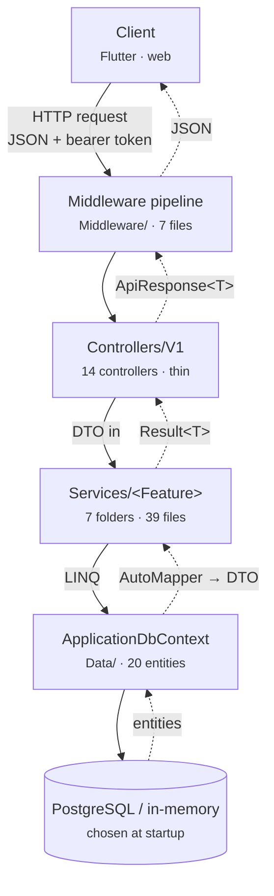

# Solar Projects API — Structure & Dataflow

ASP.NET Core REST + SignalR backend (`net10.0`, root namespace `dotnet_rest_api`) for solar
construction project management.

Every request walks the same path — **middleware pipeline → thin controller → feature service →
EF Core** — and every response comes back wrapped in one envelope. What follows is the real shape
of that path, verified against the source rather than inferred from comments.

| | |
|---|---|
| Source files (excl. `tests/`, `bin/`, `obj/`) | 157 |
| Controllers | 14 versioned + 2 base/health |
| API operations (live OpenAPI) | 153 across 109 paths |
| Service files | 39 across 7 feature folders |
| Tests | 121 passing (81 unit + 40 integration) |

---

## 1. The stack

Four layers, one direction. The type carried changes at each boundary — that transformation is
where HTTP status codes get decided.



| Boundary | Carries | Defined in |
|---|---|---|
| Controller → Service | Request DTO | `DTOs/` |
| Service → Controller | `Result<T>` / `ServiceResult<T>` | `Common/Result.cs` |
| Controller → Client | `ApiResponse<T>` | `DTOs/ApiResponse.cs` |
| Service → DbContext | LINQ over entities | `Models/` |

**Services never throw for expected failures.** They return `Result<T>`, and `BaseApiController`
converts it to the envelope. Because that conversion happens in exactly one place, a defect there
changes the status code of the entire API at once — see finding 1.

---

## 2. Middleware pipeline

Registered in `Program.cs`. Order is load-bearing, not cosmetic.


| # | Stage | Why it sits here |
|---|---|---|
| 1 | `GlobalExceptionMiddleware` | Outermost — turns an unhandled throw into the same envelope shape. |
| 2 | CORS (`FlutterAppPolicy`) | Permissive REST policy. SignalR uses a separate credentialed policy. |
| 3 | `RateLimitMiddleware` | Redis-backed, conditional on `RateLimit:Enabled`. **Before** auth so unauthenticated floods are cheap to reject. |
| 4 | Static files | Serves `uploads/` at `/files`; directory created at boot if absent. |
| 5 | Authentication | JWT bearer. Reads `?access_token=` for the SignalR handshake. |
| 6 | `JwtBlacklistMiddleware` | Rejects logged-out tokens. **After** auth — it needs the parsed token. |
| 7 | Authorization | Role gates. Use `Common/Roles.cs` constants, not raw strings. |

Verified live: `POST /api/v1/auth/logout` blacklists the bearer token and the next authenticated
call returns `401`. Stage 6 works.

---

## 3. Where the code lives

Services are organised by feature, not by technical role. Counts are `.cs` files.

| Directory | Files | Holds |
|---|---:|---|
| `Controllers/V1/` | 14 | One per feature area. Routes are `api/v{version:apiVersion}/<area>`. |
| `Controllers/` | 2 | `BaseApiController` (envelope mapping), `HealthController` (unversioned). |
| `Services/Infrastructure/` | 16 | Daily reports, notifications, work requests, images, calendar, rate limiting, seeding. |
| `Services/Shared/` | 8 | Caching, dynamic query building, validation helpers, user context. |
| `Services/Projects/` | 4 | `ProjectService` + analytics. |
| `Services/Users/` | 4 | Auth, refresh-token rotation, user CRUD. |
| `Services/WBS/` | 3 | Work breakdown structure + data seeder. |
| `Services/Tasks/` | 2 | `TaskService` and its interface. |
| `Services/MasterPlans/` | 2 | One 50 KB service file — the largest single unit in the codebase. |
| `DTOs/` | 32 | Request/response contracts plus the `ApiResponse<T>` envelope. |
| `Models/` | 20 | EF entities. Schema is generated from these. |
| `Migrations/` | 29 | Present but **bypassed at startup**. |
| `Middleware/` | 7 | The pipeline above, plus HTTP caching. |
| `Common/` | 4 | `Result<T>`, `MappingProfile`, `Roles`, Swagger filter. |
| `Hubs/` | 1 | `NotificationHub` at `/notificationHub`. |

**Schema comes from the model, not the migrations.** Startup calls `EnsureCreatedAsync()`, never
`MigrateAsync()`. The 29 files in `Migrations/` are inert at boot — a fresh database is built from
the current entity classes.

---

## 4. Channels that skip the controller

| Channel | Path | Status |
|---|---|---|
| SignalR push | `NotificationService` → `IHubContext<NotificationHub>` → `/notificationHub`. Browsers can't set handshake headers, so the JWT rides the query string and `JwtBearerEvents.OnMessageReceived` lifts it out. | Live |
| Timer service | `NotificationBackgroundService` — a plain `BackgroundService` that wakes on its own schedule and resolves scoped services per tick. | Live |
| Work queue | `IBackgroundTaskQueue` + `QueuedHostedService` are registered and the consumer loop runs — but nothing in the codebase ever enqueues an item. | Wired, unused |

---

## 5. Where the map disagrees with the territory

Each item was checked in the code or against the running service.

### 1. Missing resources return 400, not 404

`ToApiResponse` reads only the numeric `StatusCode` hint and falls back to `400`; it never consults
`ResultErrorType`. Only `CalendarService` and `WorkRequestService` set the hint via
`NotFoundResult`. Everything else uses `ErrorResult("… not found")` and lands on 400.

```
GET /api/v1/projects/{missing}   ->  400  {"message":"Project not found"}
GET /api/v1/tasks/{missing}      ->  400  {"message":"Task not found"}
GET /api/v1/calendar/{missing}   ->  404  ✓
```

`Controllers/BaseApiController.cs:205` · `Services/Projects/ProjectService.cs:96,162,184,213`

The minimal fix is mapping `ResultErrorType.NotFound → 404` inside `ToApiResponse`, which corrects
every service at once without touching call sites.

### 2. The CQRS layer does not exist

Project docs describe `ICommand`/`IQuery` handlers under `Services/Handlers/` for MasterPlans.
Neither that directory nor `Services/Interfaces/` is present, and there are zero handler types in
the repo. MasterPlans is a single 50 KB service class — the opposite of decomposed.

### 3. Two controllers reach past the service layer

`DashboardController` and `NotificationsController` inject `ApplicationDbContext` directly,
bypassing the service tier. `DashboardController` also injects `IHubContext` and pushes to SignalR
itself. (`HealthController` does the same, but legitimately — it probes connectivity.)

### 4. Stub services outlived their removal

`Services/Infrastructure/StubDailyReportService.cs` and a zero-byte `StubServices.cs` survive.
Neither is registered in `Program.cs`, so nothing resolves them — but they still surface in searches
and read as live code.

### 5. Missing parents answer two different ways

For a project ID that doesn't exist, `/calendar/project/{id}`, `/wbs/hierarchy/{id}` and
`/images/project/{id}` return `200` with an empty list, while `/daily-reports/projects/{id}` returns
*"Project not found"*. Both are defensible; only one should ship.

### 6. The 404 tests only cover the correct service

`CalendarTests.Get_Missing_Event_Returns_404_Envelope` asserts the right behaviour — on Calendar,
one of the two services that already sets the status hint. No test covers the twelve areas that
don't, which is why the 400/404 split went unnoticed.

`tests/Api.IntegrationTests/CalendarTests.cs:57`

---

Compiled from the source tree at `main` and probed against the live deployment.
